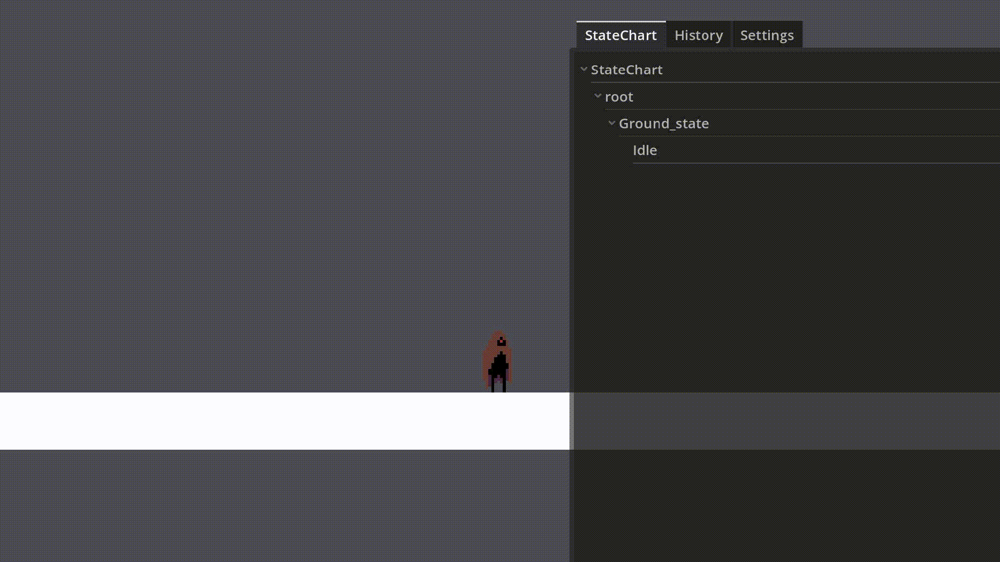
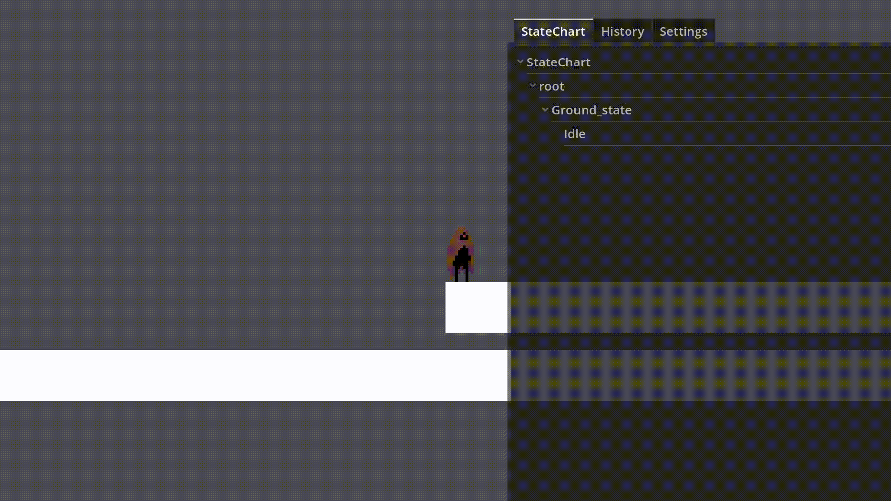
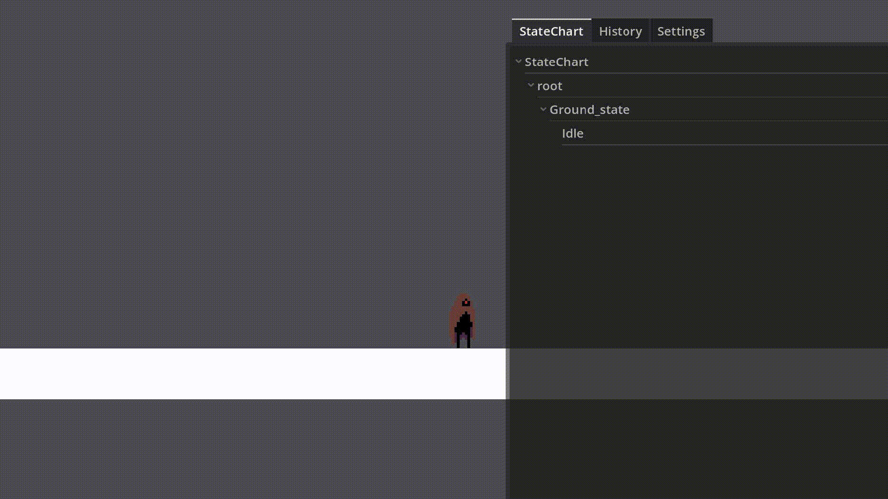

# godot-2d-player-controller
A free 2D player controller built with Godot 4, using the State Chart addon for state management. Features frame-independent movement, ground &amp; air attacks with 3-hit combos, dash (ground &amp; air), jump systems (double jump, coyote time, jump buffer), hitbox &amp; hurtbox logic, hurt/death mechanics, and priority-based state transitions. 

## Demo

### Idle & Run

### Jump & Double Jump

### Coyote Time & Jump Buffer

### Ground & Air Dash

### Ground & Air Attacks (3-Hit Combos)

### Hurt & Death States

